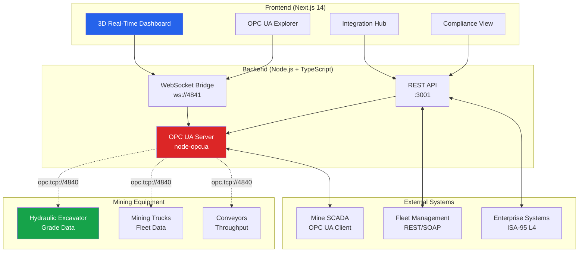

# MineSensors OPC UA Mining Integration Demo

> Empowering mining operations with standards-based, real-time ore intelligence

## 🎯 Project Vision

This demo showcases how an AI-augmented MineSensors platform can surface shovel-level grade data, feed fleet management systems (FMS) within seconds, and meet the **OPC UA Mining Companion Specification** – all wrapped in a modern, interactive UI that delights executives and engineers alike.

## 🏗️ Architecture



## 🚀 Quick Start

### Prerequisites
- **Node.js** ≥ 18.0.0
- **pnpm** ≥ 8.0.0
- **Docker** (optional, for containerized deployment)

### Development Setup

1. **Clone and install dependencies**
   ```bash
   git clone <repository-url>
   cd mining-opc-demo
   pnpm install
   ```

2. **Start development servers**
   ```bash
   # Start both frontend and backend
   pnpm dev
   
   # Or start individually
   pnpm --filter backend dev    # OPC UA server on :4840, API on :3001
   pnpm --filter frontend dev   # Next.js on :3000
   ```

3. **Access the demo**
   - **Web UI**: http://localhost:3000
   - **OPC UA Server**: opc.tcp://localhost:4840/mining-demo
   - **WebSocket**: ws://localhost:4841

### Docker Deployment

```bash
# Build and start all services
docker-compose up --build

# Access services
# - Web UI: http://localhost:3000
# - OPC UA Server: opc.tcp://localhost:4840
# - WebSocket Bridge: ws://localhost:4841
```

## 📊 Key Features

### 1. **OPC UA Server** (Port 4840)
- Node-OPCUA powered server modeling `MiningEquipmentType`
- Historical trend surface and alarm simulation
- Compliance with OPC UA Mining Companion Specification v1.0

### 2. **3D Real-Time Dashboard**
- Three.js mine pit visualization
- Equipment avatars with live positioning
- Grade heatmap overlay with real-time updates

### 3. **OPC UA Explorer**
- Interactive tree view of server address space
- Live value subscription with badge indicators
- Browse and discover mining equipment nodes

### 4. **Integration Hub**
- ISA-95 swim-lane visualization
- FMS connectivity cards showing throughput
- Multi-protocol integration (REST, SOAP, OPC UA)

### 5. **Compliance View**
- Checklist against OPC UA Mining standards
- Regional regulatory compliance tracking
- Audit trail and certification status

### 6. **Demo Scenarios**
- Trigger "high-grade discovery" events
- Simulate equipment failure scenarios
- Performance metrics and KPI tracking

## 🛠️ Technology Stack

### Backend
- **Runtime**: Node.js 18+ with TypeScript
- **OPC UA**: node-opcua (industrial automation)
- **WebSocket**: ws (real-time communication)
- **API**: Express.js with REST endpoints
- **Testing**: Jest with ts-jest

### Frontend
- **Framework**: Next.js 14 with App Router
- **Styling**: Tailwind CSS + Radix UI
- **3D Graphics**: @react-three/fiber (Three.js)
- **State**: React Query + Zustand
- **WebSocket**: native WebSocket API

### Infrastructure
- **Containerization**: Docker + Docker Compose
- **Package Manager**: pnpm workspaces
- **Code Quality**: ESLint + Prettier + Husky

## 📈 Performance Goals

- **< 2s Latency**: End-to-end data flow from equipment to UI
- **30+ msgs/s**: FMS integration throughput
- **< 60fps**: WebGL rendering on Intel UHD Graphics
- **8GB RAM**: Complete stack running on laptop

## 🔒 Security & Standards

### OPC UA Security
- X.509 certificate-based authentication
- 256-bit encryption for data transmission
- Secure channels with message signing
- Configurable security policies (None/Basic256Sha256)

### Standards Compliance
- **OPC UA Mining Companion Spec v1.0**: Equipment information models
- **ISA-95 / IEC 62264**: Enterprise-control integration
- **Industry 4.0**: Secure sensor-to-cloud connectivity

## 🧪 Testing & Validation

### OPC UA Client Testing
```bash
# Test with UA Expert (Windows)
# Endpoint: opc.tcp://localhost:4840/mining-demo
# Security: None (demo) or Basic256Sha256 (production)

# Test with opcua-commander (CLI)
npx opcua-commander -e opc.tcp://localhost:4840/mining-demo
```

### Automated Testing
```bash
# Run all tests
pnpm test

# Backend unit tests
pnpm --filter backend test

# Frontend component tests
pnpm --filter frontend test

# E2E scenarios (requires running services)
pnpm test:e2e
```

## 📁 Project Structure

```
mining-opc-demo/
├── backend/                 # OPC UA server & API
│   ├── src/
│   │   ├── server.ts       # Main OPC UA server
│   │   ├── mining/         # Mining information models
│   │   └── api/            # REST API endpoints
│   ├── tests/              # Backend unit tests
│   ├── Dockerfile          # Backend container
│   └── package.json        # Backend dependencies
├── frontend/               # Next.js web application
│   ├── src/
│   │   ├── app/            # App router pages
│   │   ├── components/     # React components
│   │   └── lib/            # Utilities & hooks
│   ├── tests/              # Frontend tests
│   ├── Dockerfile          # Frontend container
│   └── package.json        # Frontend dependencies
├── docs/                   # Documentation
│   ├── standards/          # OPC UA & ISA-95 research
│   ├── tooling/            # Technology decisions
│   └── research/           # Economic analysis
├── specs/                  # Requirements & tasks
├── spikes/                 # Proof-of-concept code
├── docker-compose.yml      # Multi-service deployment
└── package.json            # Workspace configuration
```

## 🎯 Demo Scenarios

### Scenario 1: High-Grade Discovery
- Excavator discovers high-grade ore (>3.5g/t Au)
- Real-time alert triggers in dashboard
- FMS rerouting recommendations appear
- Grade heatmap updates immediately

### Scenario 2: Equipment Health Alert
- Conveyor vibration exceeds threshold
- Maintenance notification sent via OPC UA
- Downtime impact calculated and displayed
- Alternative routing suggestions provided

### Scenario 3: Production Optimization
- Fleet coordination for optimal truck dispatch
- Real-time throughput monitoring
- Grade control feedback loop
- Economic KPI tracking ($/tonne processed)

## 🔍 Monitoring & Observability

- **OPC UA Metrics**: Connection status, message throughput, error rates
- **Performance HUD**: Latency, memory usage, WebGL frame rate
- **Business KPIs**: Production volume, grade recovery, equipment utilization
- **Compliance Status**: Standards adherence, audit readiness

## 🤝 Contributing

1. Follow the Phase-based development approach (see `specs/`)
2. Maintain OPC UA compliance and security best practices
3. Use conventional commits and automated testing
4. Document mining domain knowledge and technical decisions

## 📞 Support

- **Issues**: GitHub Issues for bug reports and feature requests
- **Documentation**: See `docs/` for technical specifications
- **Demo Questions**: Contact the mining technology team

---

**Built with ❤️ for the mining industry** | Showcasing the future of connected mining operations