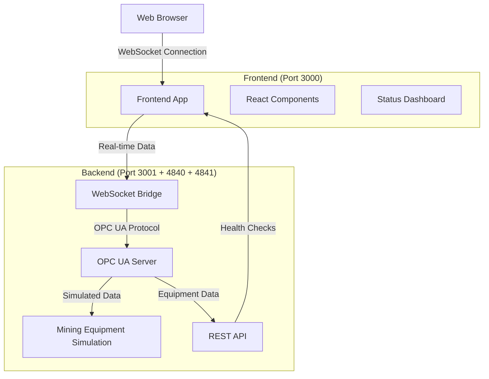

# MineSensors OPC UA Mining Demo - Architecture Overview

## 🎯 What You've Built: A Learning Journey

This document explains the architecture of your MineSensors demo in simple terms, perfect for understanding OPC UA concepts and modern web architectures.

---

## 📚 Core Concepts Explained

### What is OPC UA?
**OPC UA (Open Platform Communications Unified Architecture)** is like a universal translator for industrial equipment. Imagine you have:
- Excavators speaking "Caterpillar language"
- Trucks speaking "Komatsu language" 
- Conveyor belts speaking "Siemens language"

OPC UA lets them all communicate using one common language, so your mining software can understand all equipment regardless of manufacturer.

### What is a WebSocket?
A **WebSocket** is like a telephone line that stays open between your web browser and the server:
- **HTTP requests** are like sending letters - you send a request, wait for a response, connection closes
- **WebSockets** are like phone calls - the connection stays open, both sides can talk anytime

Perfect for real-time mining data where you need instant updates when equipment status changes.

---

## 🏗️ Current System Architecture



### The Three-Layer Architecture

| Layer | What It Does | Technologies | Port |
|-------|-------------|-------------|------|
| **Frontend** | User interface you see in browser | React, Next.js, WebSockets | 3000 |
| **WebSocket Bridge** | Real-time communication hub | Node.js WebSocket Server | 4841 |
| **OPC UA Server** | Industrial equipment communication | OPC UA Protocol | 4840 |
| **REST API** | Health checks and configuration | Express.js HTTP Server | 3001 |

---

## 🔄 How Data Flows Through the System

### 1. Equipment Simulation (Backend)
```
Mining Equipment Simulator
├── 2 Hydraulic Excavators (EX001, EX002)
├── 3 Haul Trucks (TR001, TR002, TR003)  
├── 2 Conveyor Systems (CV001, CV002)
└── Grade Control System
```

Every 2 seconds, the simulator updates:
- Equipment locations
- Fuel levels
- Operational status
- Production metrics
- Grade measurements

### 2. OPC UA Server Processing
The OPC UA server organizes this data into a **hierarchical tree structure**:

```
Root/
├── Site/
│   ├── Equipment/
│   │   ├── Excavators/
│   │   │   ├── EX001/
│   │   │   │   ├── Position (X, Y, Z coordinates)
│   │   │   │   ├── FuelLevel (0-100%)
│   │   │   │   └── Status (Active/Idle/Maintenance)
│   │   │   └── EX002/ (same structure)
│   │   ├── Trucks/ (TR001, TR002, TR003)
│   │   └── Conveyors/ (CV001, CV002)
│   └── Metrics/
│       ├── TotalProduction
│       ├── ActiveEquipment
│       └── AverageGrade
```

### 3. WebSocket Bridge Translation
The bridge converts OPC UA data into JSON messages:

```json
{
  "type": "mining_data",
  "timestamp": "2024-01-15T10:30:00Z",
  "data": {
    "siteMetrics": {
      "totalProduction": 1250.5,
      "activeEquipment": 7,
      "averageGrade": 2.34
    },
    "equipment": [
      {
        "id": "EX001",
        "type": "excavator",
        "position": { "x": 125.5, "y": 67.2, "z": 15.0 },
        "fuelLevel": 78.5,
        "status": "active"
      }
    ]
  }
}
```

### 4. Frontend Real-time Updates
Your React app receives these messages and updates the UI instantly.

---

## 📊 Current System Status

### WebSocket Connections
- **How many?** Currently 1 stable connection (after fixing the loop!)
- **Why were messages increasing?** The simulation sends updates every 2 seconds
- **Connection count**: Should stay stable around 1-5 (depending on browser tabs)

### Message Flow Statistics
| Metric | Current Behavior | Purpose |
|--------|------------------|---------|
| **Messages Received** | Increases every 2 seconds | Live equipment data updates |
| **Connection Attempts** | Should be 0-1 (stable) | WebSocket reconnection tracking |
| **Active Equipment** | 7 simulated units | Demonstrates mining fleet |

---

## 🎓 What This Architecture Teaches You

### 1. **Industrial Communication Standards**
- OPC UA is the industry standard for industrial automation
- Hierarchical data organization mirrors real mining operations
- Standards-based approach ensures interoperability

### 2. **Real-time Web Architecture**
- WebSockets enable instant data updates
- Event-driven programming for responsive UIs
- Separation of concerns (UI, API, Protocol layers)

### 3. **Modern Development Practices**
- React for component-based UI development
- TypeScript for type safety and better development experience
- Professional error handling and connection management

### 4. **Scalability Patterns**
- Microservices-like separation of concerns
- WebSocket connection pooling and management
- Simulation layer for testing without real equipment

---

## 🚀 Why This Matters for Mining

### Real-World Applications
1. **Fleet Management**: Track all equipment locations and status
2. **Production Optimization**: Real-time throughput monitoring
3. **Predictive Maintenance**: Monitor equipment health metrics
4. **Grade Control**: Optimize ore quality in real-time
5. **Safety Systems**: Instant alerts for equipment issues

### Industry Standards Compliance
- **ISA-95**: Enterprise integration architecture
- **OPC UA Mining Companion Specification**: Mining-specific data models
- **WebSocket Standards**: Modern web communication protocols

---

## 🔮 Next Steps (Phase 4 Preview)

The current architecture is perfectly positioned for:

1. **3D Visualization**: WebSocket data → Three.js mining pit visualization
2. **Equipment Tracking**: Real-time equipment movement on 3D terrain
3. **Interactive Scenarios**: Trigger events and see live responses
4. **Advanced Analytics**: Historical data trends and predictions

Your foundation is solid and follows industry best practices!

---

## 💡 Key Takeaways

✅ **You've built a professional-grade industrial communication system**  
✅ **Real-time data flows from simulated equipment to web interface**  
✅ **Architecture follows industry standards and modern web practices**  
✅ **System is ready for advanced features and real equipment integration**

This demo showcases how modern web technologies can create powerful industrial applications that are both user-friendly and technically robust.